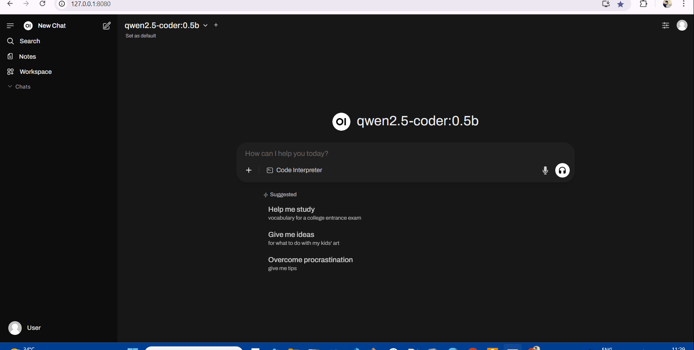

## capstone-local-llm

Demonstration of running locally **Ollama** and **Open-WebUI** on a WSL2 containerized environment.

> [!WARNING]
> This is a POC and not intended to be run on Production Environments.



### Ollama Installation:

- Make sure any container engine(Podman in this case) is installed on your WSL2 environment.

- Install ollama with below command:

**NOTE:** here `PWD/ollama` represents host directory where models data will be saved.

```  
podman run --name ollama --rm --detach --privileged --gpus all -p 11434:11434 -v $PWD/ollama:/root/.ollama ollama/ollama
```
- Verify if container is up using below command:

```
podman container ls
```

### Pulling Model in Ollama:

- Create an alias using below command:
```
 alias ollama='podman exec ollama ollama'
```

- Run below command to pull ollama model:
```
ollama pull qwen2.5-coder:0.5b
```

### Open-WebUI Installation:

- Make sure any container engine(Podman in this case) is installed on your WSL2 environment.

- Install ollama with below command:

**NOTE:** here `OLLAMA_BASE_URL`  represents endpoint where ollama is serving.saved.
```  
podman run --rm --detach --network host -p 8080:8080 -e WEBUI_AUTH=false -e OLLAMA_BASE_URL=http://127.0.0.1:11434 --name open-webui ghcr.io/open-webui/open-webui:main
```

- Verify if container is up using below command:
```
podman container ls
```

### Summary:

- **Podman** is used to run ollama and open-webui containers.

- The model Ollama is running in this example: **𝐐𝐰𝐞𝐧2.5-𝐂𝐨𝐝𝐞𝐫:0.5𝐛**

- Presently it is on CPU as i have **𝐈𝐧𝐭𝐞𝐥 𝐈𝐫𝐢𝐬𝐗𝐞 i𝐆𝐏𝐔** which is not natively supported by Ollama as of now it seems.

- **Note:** one potential method to determine compatibility of Ollama with Intel IrisXe iGPU is by leveraging the Intel Corporation **𝐢𝐩𝐞𝐱-𝐥𝐥𝐦 𝐚𝐜𝐜𝐞𝐥𝐞𝐫𝐚𝐭𝐢𝐨𝐧 𝐥𝐢𝐛𝐫𝐚𝐫𝐲**.